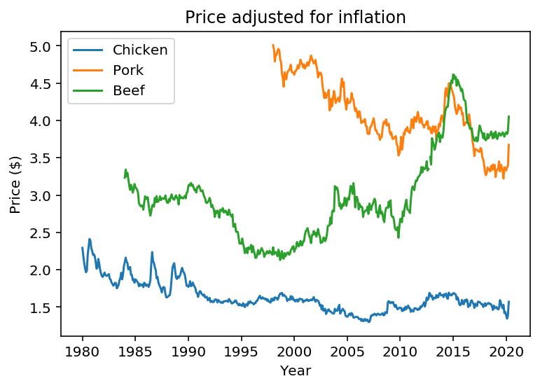

# Claims made about poultry, pork, and beef.

Article [here](https://www.bloomberg.com/news/articles/2020-05-11/why-chicken-is-plentiful-during-the-pandemic-and-beef-is-not?srnd=premium&utm_medium=social&utm_source=twitter&utm_campaign=socialflow-organic&utm_content=markets&cmpid%3D=socialflow-twitter-markets&sref=XQtHDW1P).

### “poultry costs U.S. consumers 62% less in inflation-adjusted terms than it did in 1935”

### “Pork, now also raised mostly at factory scale indoors, is 12% cheaper”

### “Beef, which isn’t, costs 63% more. “

I'm going to go to FRED and get the price of Chicken, Fresh, Whole, Per Lb. (453.6 Gm) in U.S. City Average. [Here](https://fred.stlouisfed.org/series/APU0000706111#0) This way I can download the data in a nice clean format. 

Series ID APU0000706111

I'll need to adjust for inflation, so I'll use the CPI: [CPIAUCSL](https://fred.stlouisfed.org/series/CPIAUCSL).

**Also, I can't find where he got data going all the way back to the 30s??**

