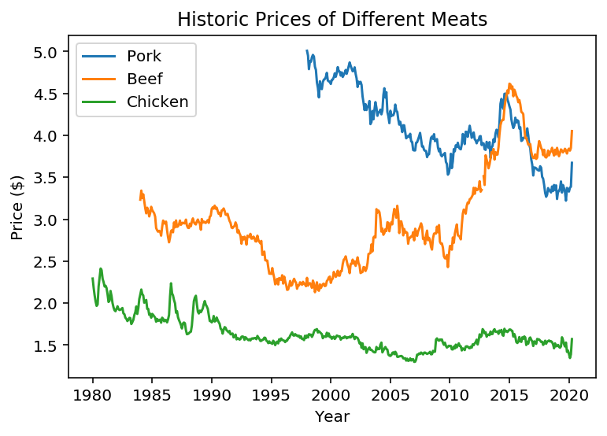

## Data sources

In order to validate the claims from [this](https://www.bloomberg.com/news/articles/2020-05-11/why-chicken-is-plentiful-during-the-pandemic-and-beef-is-not?srnd=premium&utm_medium=social&utm_source=twitter&utm_campaign=socialflow-organic&utm_content=markets&cmpid%3D=socialflow-twitter-markets&sref=XQtHDW1P) article, I pulled price data from FRED (which sources data from the BLS) and adjusted it using the CPI. Data sources are here:

- [CPI (for inflation)](https://fred.stlouisfed.org/series/CPIAUCSL)
- [Poultry](https://fred.stlouisfed.org/series/APU0000706111)
- [Pork](https://fred.stlouisfed.org/series/APU0000FD3101)
- [Beef](https://fred.stlouisfed.org/series/APU0000703112)

**A note here**: I couldn't quickly find any data that goes back to 1935, like Fox cites in the article. The earliest history I could find from FRED or the BLS only goes back to the 80s.

The following graphic shows to historic prices (adjusted for inflation) of the 3 types of meats described.

In order to summarize the price change since the historic price, I'll simply take the percentage difference between the oldest and most recent price.

## Claims

> "poultry costs U.S. consumers 62% less in inflation-adjusted terms than it did in 1935"

> "Pork, now also raised mostly at factory scale indoors, is 12% cheaper"

> "Beef, which isn’t, costs 63% more."

Here's what I found:

- From 1980 - 2020, chicken prices have declined 31.5%.
- From 1998 - 2020, the price of pork has declined 26%.
- From 1984 - 2020, the price of beef has increased 25.3%.

<table border="0" class="dataframe">
  <thead>
    <tr style="text-align: right;">
      <th></th>
      <th>Type</th>
      <th>My pct change</th>
      <th>His pct change</th>
      <th>My Years</th>
      <th>His years</th>
      <th>Extrapolated</th>
    </tr>
  </thead>
  <tbody>
    <tr>
      <th>0</th>
      <td>chicken</td>
      <td>-0.31</td>
      <td>-0.62</td>
      <td>40</td>
      <td>85</td>
      <td>-0.67</td>
    </tr>
    <tr>
      <th>1</th>
      <td>pork</td>
      <td>-0.27</td>
      <td>-0.12</td>
      <td>22</td>
      <td>85</td>
      <td>-1.03</td>
    </tr>
    <tr>
      <th>2</th>
      <td>beef</td>
      <td>0.25</td>
      <td>0.63</td>
      <td>36</td>
      <td>85</td>
      <td>0.60</td>
    </tr>
  </tbody>
</table>

Now I can look at how far off I was.

<table border="0" class="dataframe">
  <thead>
    <tr style="text-align: right;">
      <th></th>
      <th>Type</th>
      <th>error</th>
    </tr>
  </thead>
  <tbody>
    <tr>
      <th>0</th>
      <td>chicken</td>
      <td>-0.05</td>
    </tr>
    <tr>
      <th>1</th>
      <td>pork</td>
      <td>-0.91</td>
    </tr>
    <tr>
      <th>2</th>
      <td>beef</td>
      <td>-0.03</td>
    </tr>
  </tbody>
</table>

## Final Notes

- 2 / 3 statistics were pretty close, something weird happens with pork tho, 90% error
- Maybe I deflated prices using a different CPI than the author
