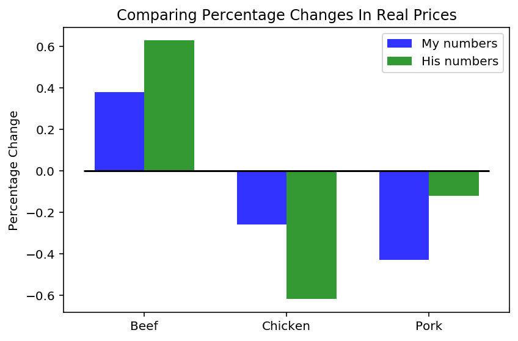

## Data sources

In order to validate the claims from [this](https://www.bloomberg.com/news/articles/2020-05-11/why-chicken-is-plentiful-during-the-pandemic-and-beef-is-not?srnd=premium&utm_medium=social&utm_source=twitter&utm_campaign=socialflow-organic&utm_content=markets&cmpid%3D=socialflow-twitter-markets&sref=XQtHDW1P) article, I downloaded price data from [FRED](https://fred.stlouisfed.org) and adjusted it using the CPI. Data sources are here:

- [Poultry](https://fred.stlouisfed.org/series/APU0000706111)
- [Pork](https://fred.stlouisfed.org/series/APU0000FD3101)
- [Beef](https://fred.stlouisfed.org/series/APU0000703112)

The chart below shows how the average price of 3 different types of meats has changed over time.

To adjust for the change in purchasing power I'll use the CPI.

A couple things to note about the real prices:

- Pork has declined in 26.2% from 1998
- Beef has increased 25% from 1984
- Chicken has decreased 31.4% since 1980

In order to adjust for the different number of years of data between myself and the author, I'll compute the average price change per month and extrapolate backwards. This requires the assumption that the growth rates between all the meats are constant and is likely too simple.

I arrive at the above numbers, which had identical directions as the author. Click [here](https://anthonyyoskovich.com/project/trust-but-verify/) to see the longer form post.
